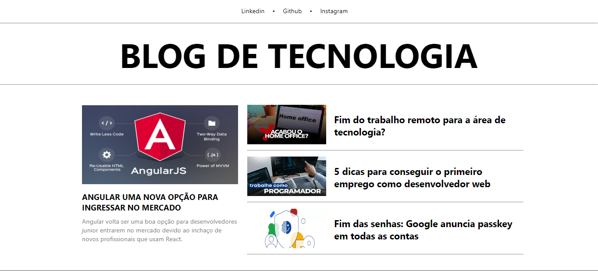
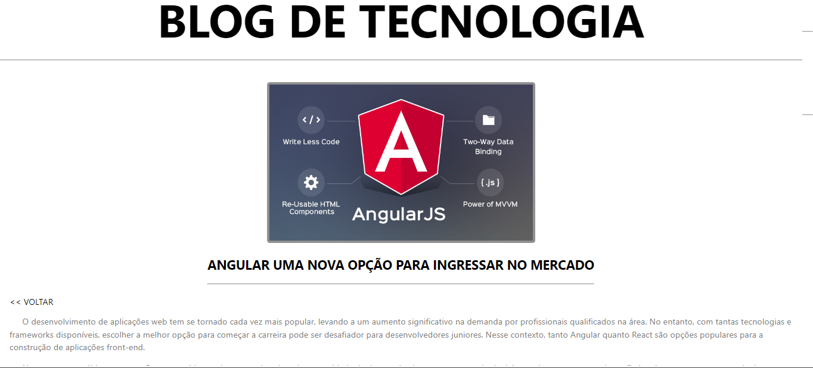

# **Blog sobre Tecnologia** 

## **Descrição** 
Blog para divulgar dicas e novidades sobre tecnologia. 

<hr>

## **Acessar Aplicação**
[Deploy Blog](https://angular-blog-ashen.vercel.app/)

<hr>

## **Objetivos**
Criar um blog utilizando Typescript e Angular;

## **Tecnologias**
Este projeto foi desenvolvido com as seguintes tecnologias:
- HTML;
- CSS;
- TypeScript;
- Angular;

<hr>

## **Requerimentos**
- Node.js;
- npm ou yarn;

## **Instalação**
`npm install`

## Start Projeto

Primeiro, execute o servidor de desenvolvimento:

```bash
npm start
# or
ng s -o
```

Abra [http://localhost:4200/](http://localhost:4200/) com seu navegador para ver o resultado.

## **Clone do Projeto**
`https://github.com/WalkerBrum/angular-blog.git`

# 📷 Demonstração da Aplicação





## **Autor e Agradecimento**
Eu Walker Lobato como desenvolvedor do projeto sou grato por poder participar desse desafio técnico promovido pela Ímpar, pois foi um grande oportunidade para o desenvolvimento das minhas hard skills, aprimorando os meus conhecimentos na construção de aplicações web.
